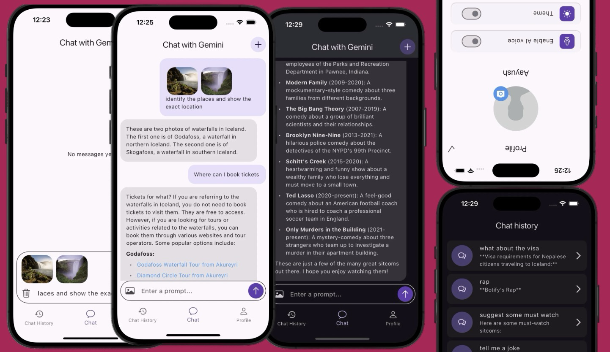

# Gemini AI Chatbot App

A Flutter-powered mobile application that delivers an interactive experience through an AI chatbot named **Gemini**. The app enables real-time conversations, stores message history locally, and offers a sleek user interface for seamless interaction.

## 📸 Screenshot



## ✨ Key Features

- **Interactive Chat Interface** – Have dynamic, two-way conversations with Gemini.
- **Persistent Chat History** – Review and revisit past conversations at any time.
- **Auto Scrolling** – New messages appear at the bottom with smooth automatic scrolling.
- **Local Storage with Hive** – Utilizes Hive database for efficient offline storage of chats and other app data.

## 📦 Dependencies

| Package              | Purpose                                                                 |
|----------------------|-------------------------------------------------------------------------|
| `flutter`            | Core framework for building cross-platform mobile apps.                |
| `cupertino_icons`    | Adds iOS-style icons (optional).                                        |
| `flutter_dotenv`     | Loads environment variables from `.env` file (optional).                |
| `flutter_markdown`   | Renders markdown content inside the Flutter app.                        |
| `flutter_spinkit`    | Adds animated loading indicators (optional).                            |
| `google_generative_ai` | Connects the app to Google’s Generative AI services.                  |
| `hive`               | Lightweight NoSQL database for local storage.                           |
| `hive_flutter`       | Flutter-specific adapter for Hive.                                      |
| `image_picker`       | Lets users select images from gallery or camera.                        |
| `path_provider`      | Identifies platform-specific paths for file storage.                    |
| `provider`           | A simple yet powerful state management tool.                            |
| `uuid`               | Generates unique IDs for messages or sessions.                          |

## 🚀 Getting Started

### 1. Prerequisites
Ensure you have Flutter and Dart set up on your system. Follow the official installation guide:  
👉 [Flutter Installation Guide](https://docs.flutter.dev/get-started/install)

### 2. Clone the Repository
Clone this repo or download the project files:
```bash
git clone https://github.com/your-username/ai-chatbot-app.git
cd ai-chatbot-app
```

### 3. Configure the API Key
Head over to [Google AI for Developers](https://ai.google.dev/) to get your **Gemini API Key**.  
Then, create a `.env` file in the root directory and add:
```
GEMINI_API_KEY=your_api_key_here
```

### 4. Install Dependencies & Run
Run the following commands:
```bash
flutter pub get
flutter run
```

## 📱 App Usage

Upon launch, the app presents a clean home screen that acts as the central hub. Users can:
- Start or continue conversations with Gemini.
- Scroll through and manage past messages.
- Navigate to user profile and app settings.

## 🤝 Contributing

Contributions are always welcome!  
If you have ideas, feature requests, or fixes, feel free to fork this project and open a pull request.

## 📄 License

This project is licensed under the **MIT License**.  
See the [LICENSE](LICENSE) file for full details.

## 👤 Author

**Aayush D.C Dangi**  
GitHub: [@dcaayushd](https://github.com/dcaayushd)
